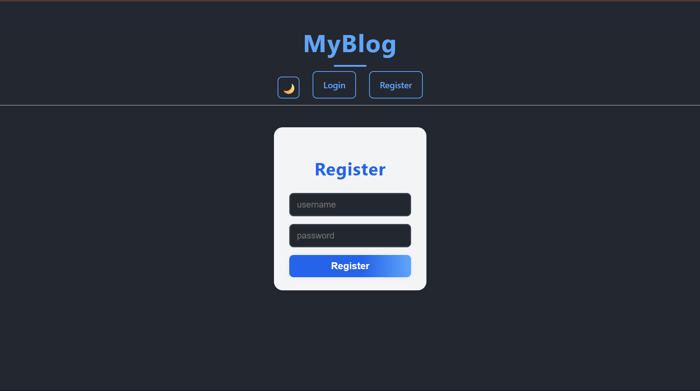
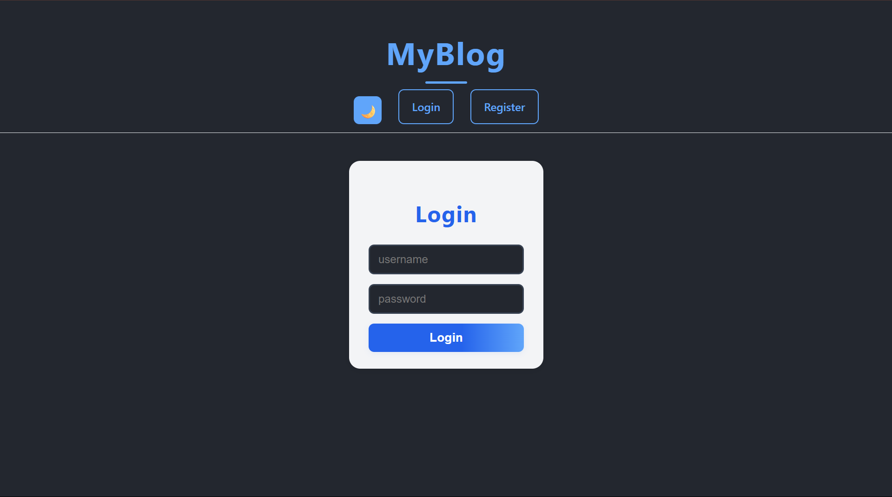
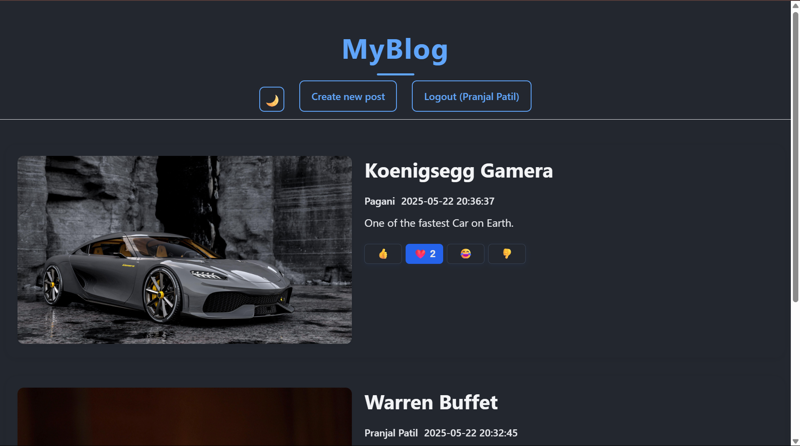
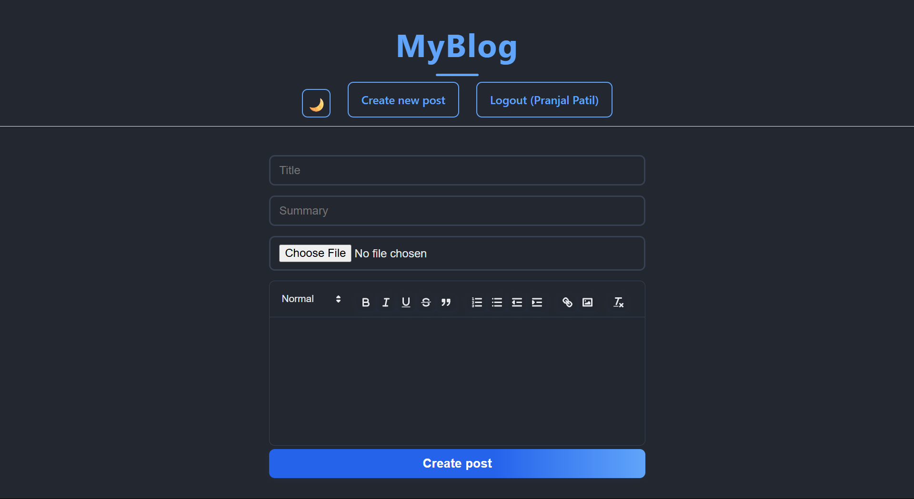
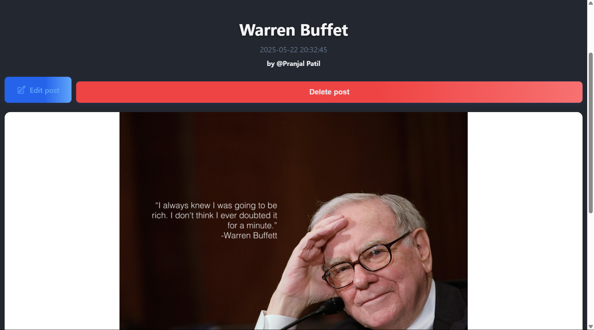
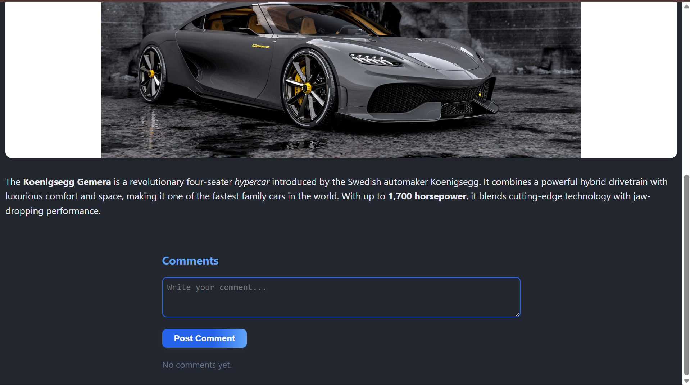

# Blogging Website - MERN Stack Application

A full-featured blogging platform built with the MERN stack (MongoDB, Express.js, React, Node.js).

## Screenshots

### Register Page


### Login Page


### Home Page


### Create Page


### Edit Delete


### Comments


---

## Features

- **User Authentication**: Register, login, and manage user sessions
- **Create/Edit/Delete Posts**: Full CRUD for blog posts
- **Rich Text Editor**: Write posts with formatting and images
- **Comments**: Users can comment on posts
- **Reactions**: Like or react to posts
- **Responsive Design**: Works on desktop and mobile
- **Dark Mode**: Toggle between light and dark themes

## Tech Stack

- **Frontend**: React.js
- **Backend**: Node.js with Express.js
- **Database**: MongoDB
- **Styling**: Custom CSS

## Project Structure

```text
mern-blog/
├── client/                   # Frontend React application
│   ├── public/
│   │   ├── index.html
│   │   └── manifest.json
│   ├── src/
│   │   ├── pages/            # Page components (Login, Register, PostPage, etc.)
│   │   ├── App.js            # Main React application
│   │   ├── App.css           # Styles
│   │   └── ...
│   └── ...         # Frontend dependencies
│
├── api/                      # Backend Node.js/Express application
│   ├── index.js              # Main server file
│   ├── models/               # Mongoose models (User.js, Post.js)
│   └── ...
├── README.md                 # Project documentation
└── .gitignore                # Git ignore file
```

## API Endpoints

| Method | Endpoint           | Description                  |
|--------|--------------------|------------------------------|
| POST   | `/api/register`    | Register a new user          |
| POST   | `/api/login`       | Login user                   |
| POST   | `/api/post`        | Create a new post            |
| GET    | `/api/post/:id`    | Get a single post            |
| PUT    | `/api/post/:id`    | Edit a post                  |
| DELETE | `/api/post/:id`    | Delete a post                |
| POST   | `/api/comment`     | Add a comment to a post      |

## Installation & Setup

### Prerequisites

- Node.js (v14+ recommended)
- MongoDB (local or Atlas)
- npm or yarn (for package management)

### Setup Instructions

1. **Clone the repository**

```sh
git clone https://github.com/pranjalpatil-23/BloggingProject.git
cd BloggingProject
```

1. **Install backend dependencies**

Using npm:

```sh
cd api
npm install
```

Or using yarn:

```sh
cd api
yarn install
```

1. **Set environment variables**

Create a `.env` file in the `api` directory with the following:

```env
MONGO_URI=mongodb://localhost:27017/blogdb
PORT=5000
NODE_ENV=development
JWT_SECRET=your_jwt_secret
```

1. **Install frontend dependencies**

Using npm:

```sh
cd ../client
npm install
```

Or using yarn:

```sh
cd ../client
yarn install
```

1. **Run the application**

In the `api` directory:

Using npm:

```sh
npm run dev
```

Or using yarn:

```sh
yarn dev
```

In the `client` directory:

Using npm:

```sh
npm start
```

Or using yarn:

```sh
yarn start
```

1. **Access the application**

Open your browser and navigate to `http://localhost:3000`

## Usage

1. Register or login as a user
2. Create, edit, or delete blog posts
3. Comment and react to posts
4. Enjoy blogging!

## MongoDB Schemas (Sample)

### User

- `username`: String (unique)
- `password`: String (hashed)

### Post

- `title`: String
- `summary`: String
- `content`: String
- `cover`: String (image path)
- `author`: ObjectId (User)
- `createdAt`: Date
- `comments`: Array
- `reactions`: Object


